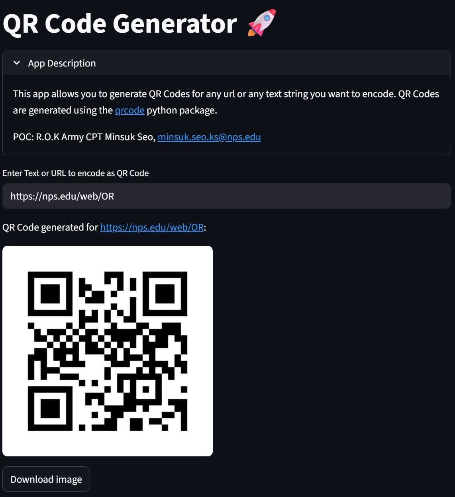

# Minsuk Seo

### R.O.K Army Infantry Officer

**Interested In:** Data Analysis, AI/ML, Infrastructure Resilience, Markov Decision Process, Network Optimization

**Skills:** Python and R Data Analysis Ecosystem, Web Dashboards, a variety of Optimization methods

## Contact Me
- **Email:** smith44189@gmail.com
- **Phone:** 831-275-8632

## Education

<table>
  <tr>
    <td>MS, Operations Research</td>
    <td>Naval Postgraduate School (<i>2025~</i>)</td>
  </tr>
  <tr>
    <td>MS, Operations Research</td>
    <td>Korea National Defense University (<i>2024~</i>)</td>
  </tr>
  <tr>
    <td>BS, Management and Military Art and Science</td>
    <td>Korea Military Academy (<i>2006</i>)(<i>cum laude</i>)</td>
  </tr>
</table>

## Work Experience
As an infantry officer, I bring a wide range of operational experience, including assignments at the frontlines in confrontation with the North Korean Army, in rear areas, as a security detail for the Presidential Security Service, and as a company commander at a General Outpost(GOP) unit. I also served as an instructor at the NCO Academy.

## Projects

### Streamlit App for Generating QR Codes
[Git Repo](https://github.com/smith44189/py_qrcode_gen)

Designed and developed a dynamic streamlit dashboard to enable NPS community to build custom QR Codes.

